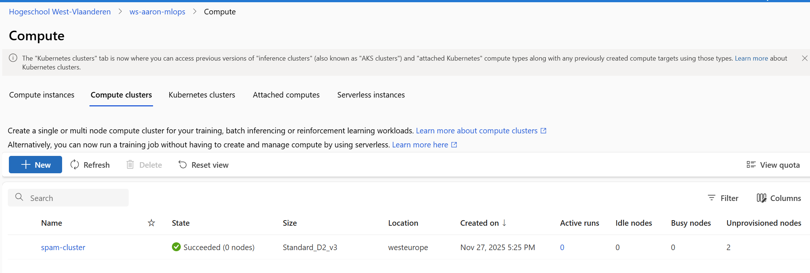
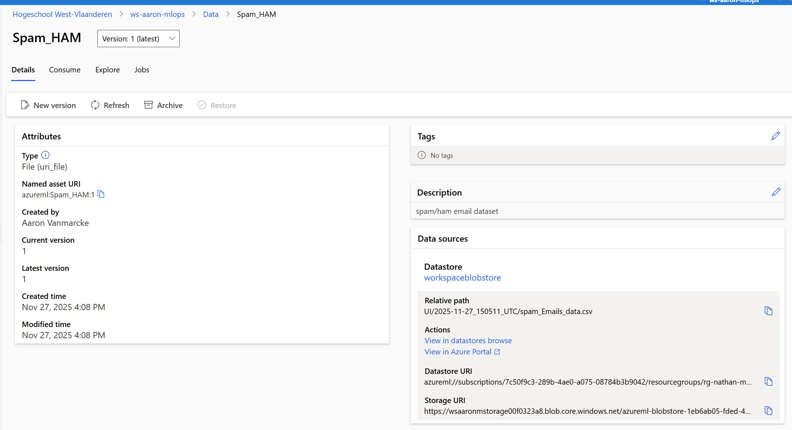
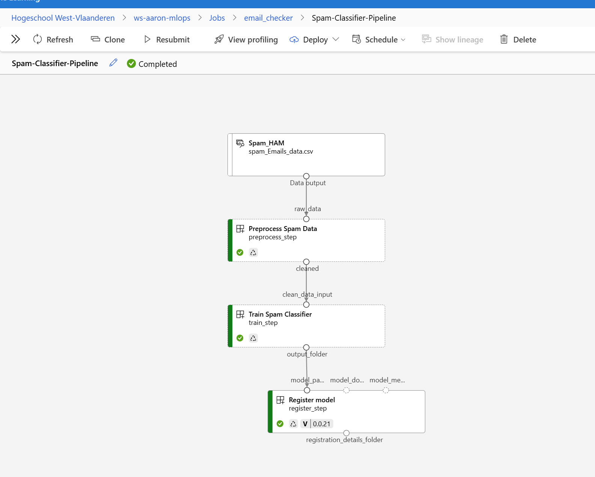
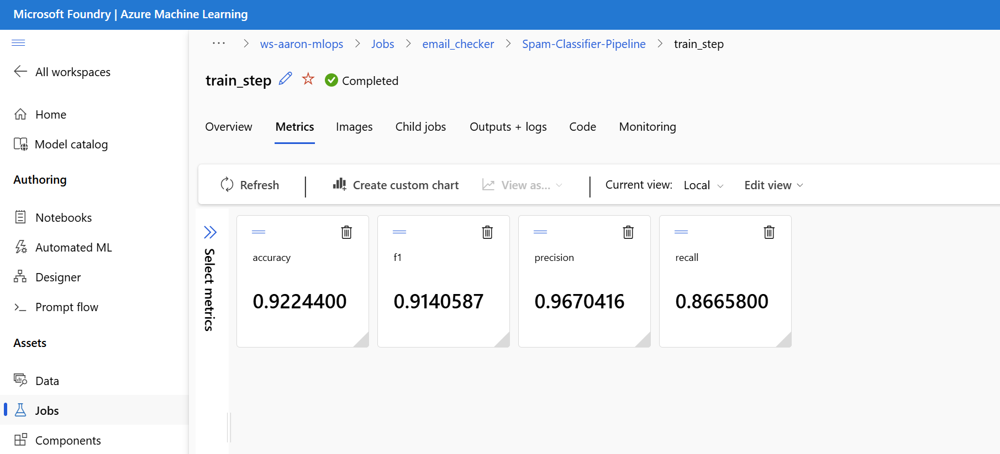
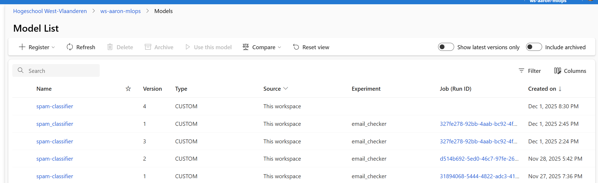
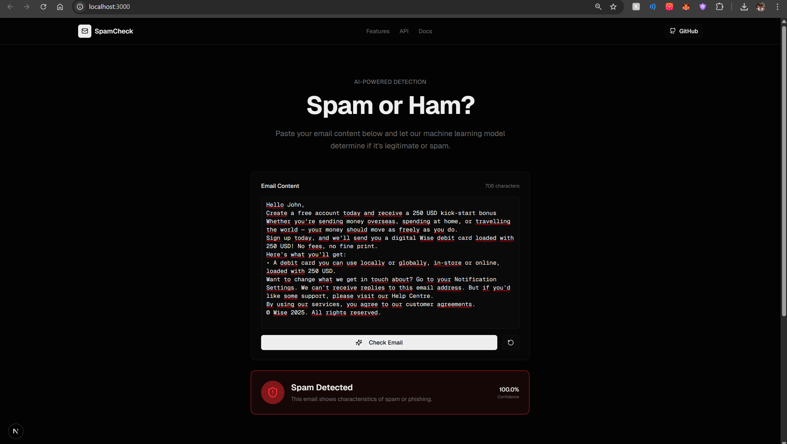
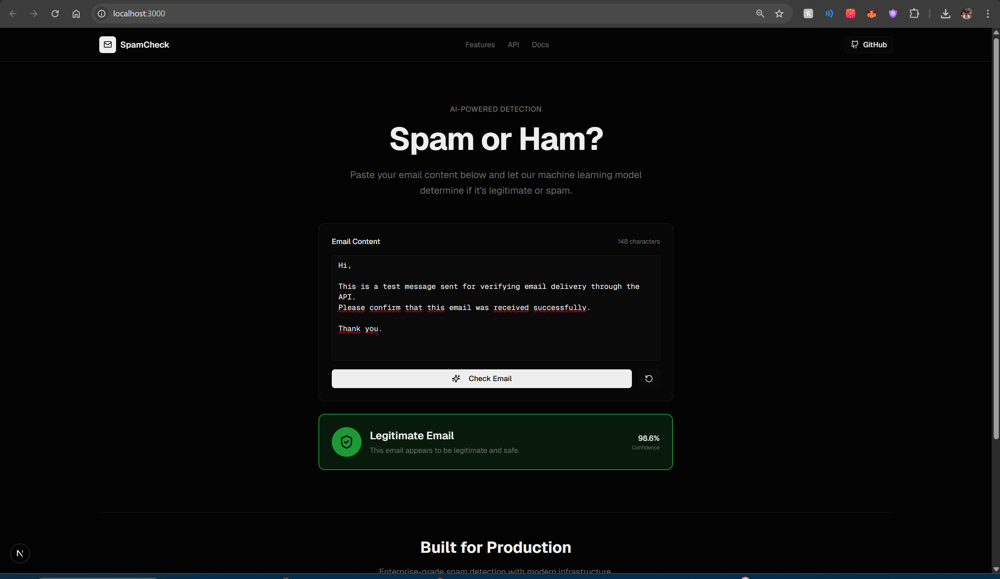

# Spam Classifier Project – MLOps Rapport
Project by Aaron Vanmarcke
## 1. Projectomschrijvings

<!-- add github repo -->
### github repo:
[github repo](https://github.com/AaronWheezer/email_checker)

### Doel
Dit project bouwt een **end-to-end machine learning pipeline** die e-mails classificeert als **spam** of **ham** (geen spam). Het model wordt getraind in de cloud via **Azure Machine Learning**, verpakt in een **FastAPI**-container en gedeployed via **Kubernetes**.

### Dataset
- **Bron:** [190k Spam/Ham Email Dataset (Kaggle)](https://www.kaggle.com/datasets/meruvulikith/190k-spam-ham-email-dataset-for-classification)
- **Locatie in repo:** `backend/data/`
- **Inhoud:** ~190.000 e-mails met labels `Spam` of `Ham`.
- **Kolommen:** `text` (de e-mailinhoud) en `label`.

### AI Model
| Onderdeel | Keuze |
|-----------|-------|
| Vectorisatie | `CountVectorizer` (bag-of-words, max 5000 features) |
| Classifier | `MultinomialNB` (Naive Bayes) |
| Framework | scikit-learn `Pipeline` + MLflow tracking |

### Dataverwerking (Preprocessing)
1. Lege rijen verwijderen (`dropna`).
2. Labels mappen naar integers: `Spam → 1`, `Ham → 0`.
3. Opslaan als `processed_spam_data.csv`.

De preprocessing-stap draait als apart component in de Azure ML Pipeline (`backend/components/preprocess/`).

---

## 2. Cloud AI Services – Azure Machine Learning

### 2.1 Workspace & Compute
In de **Azure ML Studio** is een workspace `ws-aaron-mlops` aangemaakt met een compute cluster `spam-cluster` (CPU-based) voor training.

> 📸 

### 2.2 Data Asset
De Kaggle-dataset is geüpload als **Data Asset** `Spam_HAM:1` (type `uri_file`).

> 📸 

### 2.3 Pipeline
De training loopt via een **Azure ML Pipeline** (`backend/pipeline.yaml`) met drie stappen:

```
┌─────────────────┐      ┌─────────────────┐      ┌─────────────────┐
│  preprocess_step │ ──▶ │   train_step    │ ──▶ │  register_step  │
└─────────────────┘      └─────────────────┘      └─────────────────┘
```

1. **preprocess_step** – Ruwe data schoonmaken.
2. **train_step** – Model trainen en metrics loggen (accuracy, precision, recall, F1).
3. **register_step** – Model registreren in de Model Registry als `spam-classifier`.

> 📸 


### 2.4 Metrics:
> 📸 s
> 
### 2.5 Model Registry
Na succesvolle training is het model beschikbaar onder **Models → spam-classifier**. Elke run creëert een nieuwe versie.

> 📸 

---

## 3. FastAPI – Inference Service

### 3.1 Implementatie
De API staat in `inference/app.py` en biedt:

| Endpoint | Methode | Beschrijving |
|----------|---------|--------------|
| `/health` | GET | Health-check voor Kubernetes probes |
| `/predict` | POST | Ontvang JSON `{"text": "..."}`, retourneer `{"prediction": "spam"/"ham", "confidence": 98.5, "probabilities": {...}}` |

**Belangrijke features:**
- **CORS** ingeschakeld zodat de frontend (Next.js) rechtstreeks kan aanroepen.
- **Dual model loading:** ondersteunt zowel MLflow-model als raw `model.pkl`.
- **SQLite logging (optioneel):** elke voorspelling wordt opgeslagen voor audit/analyse.

### 3.2 Dockerfile
```dockerfile
FROM python:3.11-slim
WORKDIR /app
COPY app.py requirements.txt ./
RUN pip install --no-cache-dir -r requirements.txt
EXPOSE 8000
CMD ["uvicorn", "app:app", "--host", "0.0.0.0", "--port", "8000"]
```

### 3.3 Integratie in bestaande software
| Scenario | Integratie |
|----------|------------|
| **E-mailserver** | Middleware die binnenkomende mail naar `/predict` stuurt en spam automatisch filtert. |
| **Helpdesk ticketing** | Tickets labelen als potentiële spam voordat ze bij agents terechtkomen. |
| **Marketing automation** | Controleren of uitgaande mails spam-achtig zijn om deliverability te verbeteren. |
| **Frontend dashboard** | Zoals de Next.js app in `frontend/` die real-time feedback toont. |

---

## 4. Kubernetes Deployment

### 4.1 Manifest (`kubernetes/deployment.yaml`)
- **Deployment** met 2 replica's voor high availability.
- **Liveness & Readiness probes** op `/health`.
- **Resource limits** (CPU/memory) om eerlijke scheduling te garanderen.
- **Service** type `LoadBalancer` voor externe toegang.

### 4.2 Extra's
| Feature | Toelichting |
|---------|-------------|
| **k3d (lokale cluster)** | GitHub Actions maakt een tijdelijke k3d-cluster aan om deployment te testen zonder cloud-kosten. |
| **Image import** | Na `docker build` wordt de image direct in k3d geïmporteerd (`k3d image import`), geen registry pull nodig. |
| **Placeholder tag replacement** | Workflow vervangt `LATEST_TAG_PLACEHOLDER` dynamisch met de commit-specifieke tag. |

---

## 5. Automatisering

### 5.1 GitHub Actions Workflow (`.github/workflows/train_pipeline.yml`)

```
┌───────────────────┐
│      train        │  (ubuntu-latest)
│  - az ml job      │
│  - stream logs    │
└────────┬──────────┘
         │ needs
         ▼
┌───────────────────┐
│     download      │  (ubuntu-24.04)
│  - az ml model    │
│    download       │
│  - upload artifact│
└────────┬──────────┘
         │ needs
         ▼
┌───────────────────┐
│      deploy       │  (self-hosted)
│  - k3d cluster    │
│  - docker build   │
│  - kubectl apply  │
│  - cleanup        │
└───────────────────┘
```

### 5.2 Triggers
- **Push** naar `main` in `backend/src/**` of `backend/pipeline.yaml`.
- **Manual** via `workflow_dispatch`.

### 5.3 Secrets
| Secret | Doel |
|--------|------|
| `AZURE_CREDENTIALS` | Service principal voor Azure CLI login |
| `GITHUB_TOKEN` | Automatisch beschikbaar, voor GHCR push |

### 5.4 Version Control
- Elke commit krijgt een unieke Docker-tag (`sha-xxxxxx`).
- Azure ML Model Registry houdt versies bij per pipeline-run.
- Git history + Actions logs bieden volledige traceerbaarheid.

---

## 6. Frontend (Next.js)

De frontend in `frontend/` is een **Next.js** applicatie met:

- **EmailChecker component** – Formulier om e-mailtekst in te voeren.
- **Real-time feedback** – Toont "Spam" of "Ham" met confidence-percentage.
- **Omgevingsvariabele** `NEXT_PUBLIC_API_URL` – Wijst naar de API (lokaal of cluster).

Start lokaal:
```bash
cd frontend
npm install
npm run dev
```
Stel `.env.local` in:
```
NEXT_PUBLIC_API_URL=http://localhost:8000
```

---

## 7. Conclusie

Dit project demonstreert een volledige **MLOps-cyclus**:

1. **Data** → Kaggle dataset geüpload naar Azure ML.
2. **Training** → Geautomatiseerde pipeline met preprocessing, training en model-registratie.
3. **Serving** → FastAPI container met health-checks en probability output.
4. **Deployment** → Kubernetes manifest met probes en resource limits.
5. **Automation** → GitHub Actions voor CI/CD: train → download → deploy.
6. **Frontend** → Next.js dashboard voor eindgebruikers.

Door deze opzet kan het model continu worden verbeterd: push nieuwe code → pipeline runt → nieuw model wordt gedeployed → frontend toont direct de nieuwe resultaten. 🚀

---

## 8. Deployment – Praktische Handleiding

### 8.1 Docker (altijd laatste versie)

```pwsh
# Gebruik de 'main' tag om altijd de laatste build te trekken
docker pull ghcr.io/aaronwheezer/email-spam-api:main
docker run -d -p 8000:8000 --name spam-api ghcr.io/aaronwheezer/email-spam-api:main
```

Frontend `.env.local`:

```
NEXT_PUBLIC_API_URL=http://localhost:8000
```

### 8.2 Kubernetes (k3d) met GHCR-image

```pwsh
# 1) Cluster maken
k3d cluster create spam-dev
k3d kubeconfig merge spam-dev --kubeconfig-switch-context

# 2) Deployen met lokale manifest (gebruik GHCR 'main' tag)
# Zorg dat in kubernetes/deployment.local.yaml de image is:
# image: ghcr.io/aaronwheezer/email-spam-api:main

kubectl apply -f .\kubernetes\deployment.local.yaml
kubectl get pods
kubectl get svc spam-classifier-service-local

# 3) Endpoint bereikbaar maken (stabiel)
# Port-forward direct naar de deployment (werkt betrouwbaarder)
kubectl port-forward deployment/spam-classifier-api-local 8000:8000
```

Frontend `.env.local`:

```
NEXT_PUBLIC_API_URL=http://localhost:8000
```

Notities:

- De `main` tag verwijst naar de laatste succesvolle CI/CD build. Gebruik deze om altijd up-to-date te zijn.


# 9. Eindresultaat



# 10 . Wat kan er beter?
- **Dataset uitbreiden:** Meer diverse e-mails voor robuustere modellen.
